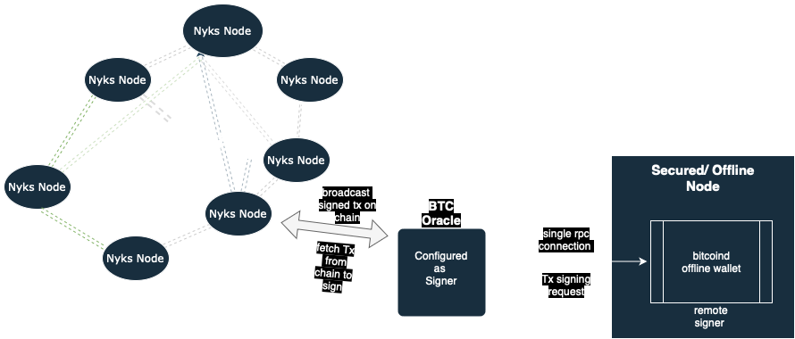

# Btc-Signer Setup Guide 🧪 ⚙️

This folder contains docker files necessary for setting-up and deploying the Btc-Signer node according to the proposed [architecture](./btc-signer-setup-architecture.png).

## Docker Features

The btc-signer-docker script performs the following tasks:

- **Nyks**: Builds and runs the Nyks full node using [Ignite CLI](https://docs.ignite.com) tools.
- **BTC Oracle**: Builds and runs the BTC Oracle.
- **Storage (Postgres)**: Creates a PostgreSQL container with a volume for persistent storage, sets up the necessary databases, and applies the required schemas for Btc-oracle.

## Architecture



## 1. Overview
The architecture includes the following components:
- **BTC Oracle**: A server responsible for fetching unsigned sweep transactions from the Nyks chain and publishing the signed transactions back on-chain.
- **bitcoind Offline Wallet**: A server that hosts a single wallet containing a single signer BTC key. This server is used to sign sweep transactions forwarded by the BTC Oracle.
- **NYKS Full Node**: A NYKS full node monitoring the sweep transactions. 

**For a production environment, it is highly recommended to deploy the bitcoind Offline Wallet and the NYKS Full Node/BTC Oracle on separate hosts**.

## 2. BTC offline wallet setup

We use [bitcoind](https://github.com/bitcoin/bitcoin/blob/master/doc/offline-signing-tutorial.md) full node implementation to configure the BTC Offline wallet. 

### 2.1. Hardware Requirements

Offline Wallet:
- An instance with at least 4G RAM and 2 vCPUs is expected
- At least 10G of persistent storage should be available for the BTC Wallet

*Notes on storage*
- The underlying storage for the offline wallet should be encrypted.
- Offline Wallet should be frequently backed up on a filesystem level to ensure continuous operation in case of
  failure / data corruption.
- We suggest a rolling backup method comprising hourly, daily and weekly backups.

### 2.2. Network Requirements

- The bitcoind Offline Wallet is only reachable from the BTC Oracle at
  the designated BTC RPC port
- The bitcoind Offline Wallet accepts only TLS traffic
- The bitcoind Offline Wallet lives on a private network and doesn't have
  internet access

### 2.3. Installation

Download and install the bitcoin binaries according to your operating system
from the official
[Bitcoind Core registry](https://bitcoincore.org/bin/bitcoin-core-27.0/).
All programs in this guide are compatible with version `27.0`.

### 2.4. Configuration

bitcoind is configured through a main configuration file named `bitcoin.conf`.

Depending on the operating system, the configuration file should be placed under
the corresponding path:
- **MacOS**: `/Users/<username>/Library/Application Support/Bitcoin`
- **Linux**: `/home/<username>/.bitcoin`
- **Windows**: `C:\Users\<username>\AppData\Roaming\Bitcoin`

```shell
# Accept command line and JSON-RPC commands
server=1
# Enable transaction indexing
txindex=0
# RPC server settings
rpcuser=<rpc-username>
rpcpassword=<rpc-password>

# Port your bitcoin node will listen for incoming requests;
# below port is the canonical port for signet,
# for mainnet, typically 8332 is used
rpcport=38332
# Address your bitcoin node will listen for incoming requests
rpcbind=0.0.0.0
# Optional: Needed for remote node connectivity
rpcallowip=0.0.0.0/0
```

It's very important to ensure that **the Offline Wallet server does not
connect with other nodes**. To achieve this, append the following to the end
of the Offline Wallet server's configuration:

```shell
# IMPORTANT: Offline Wallet server shouldn't connect to any external node
connect=0
```

Notes:
- Instead of hardcoding the RPC server password (`rpcpassword`) in the config,
  it is recommended to generate its salted hash and use the `rpcauth` field
  instead. To generate the salted hash, you can use
  [this platform](https://jlopp.github.io/bitcoin-core-rpc-auth-generator/)
  as reference - however, the salting operation should be executed locally.
  The resulting config value will look like this:
  ```shell
  rpcauth=<rpc-password-salted-hash>
  ```

### 2.5. Boot

In case you're using the default bitcoind home directory, you can boot your
bitcoind server by simply running:

```shell
bitcoind
```

In case you're using a non-default home directory:

```shell
bitcoind -datadir=/path/to/bitcoin/home
```

The following operations should be performed by the bitcoind offline wallet so
that it can be used by the BTC Oracle.

### 2.6. Create Descriptor Wallet and Oracle Key

The bitcoind Offline Wallet server will host a descriptor BTC
wallet. This wallet will contain a single address, whose private key will
be used as the Oracle BTC key to sing transactions.

**Throughout this whole process, the bitcoind Offline Wallet should not have
internet access.**

1. Create the wallet
    ```shell
    bitcoin-cli -named createwallet \
        wallet_name=<wallet_name> \
        passphrase="<passphrase>" \
        load_on_startup=true \
    ```

    Flags explanation:
    - `wallet_name`: The name of the wallet
    - `passphrase`: The passphrase that will be used to encrypt the wallet
      (**IMPORTANT, MUST BE SAFELY STORED**)
    - `load_on_startup=true`: Ensures that the wallet is automatically loaded in
      case of server restart

2. Create a new address
    ```shell
    # Save the output of this command
    bitcoin-cli getnewaddress
    ```

3. Obtain 33-byte BTC public key derived from the above address
    ```shell
    bitcoin-cli getaddressinfo <btc_address> | jq -r .pubkey
    ```

Notes:
- In case you used a non-default bitcoin home directory, also include the
  `-datadir=/path/to/bitcoin/home` flag in all the above `bitcoin-cli` commands.


### 2.7. Unlock the wallet

The BTC Oracle expects that the bitcoind Offline Wallet is unlocked when
trying to contact it. To this end, you'll need to manually unlock the wallet
before proceeding with transaction signing.

To unlock the wallet, execute the following command on the offline server:

```shell
bitcoin-cli walletpassphrase "<passphrase>" <unlock_time>
```

where:
- `passphrase`: The wallet passphrase specified during the wallet creation step
- `unlock_time`: How long (**in seconds**) the wallet will remain unlocked for

Notes:
- You can either unlock the wallet for a long period of time, or set up an
  automation to unlock it periodically for shorter time periods. In the latter
  case, the automation will require secure access to the wallet passphrase.
- In case of server restart, the wallet will need to be unlocked again.

### 2.8. Securing the passphrase
Add the instructions to run a `pass` utility based encryption on wallet passphrase here. 
### 2.9. Back-up the wallet

For the bitcoind wallet, bitcoin-level backups can also be obtained through the
following process.

```shell
# Backup the wallet
bitcoin-cli -rpcwallet=<wallet-name> backupwallet /path/to/backup/wallet.dat
# Restore the wallet
bitcoin-cli restorewallet <wallet-name> /path/to/backup/wallet.dat
```

*Note*: We recommend creating multiple backups of the wallet and
storing them in separate places.

### 2.10. Setup BTC Oracle

The oracle can be deployed using the provided docker file. The file contains instructions to deploy a NYKS full node and connect it to an existing network and BTC Oracle.

To build and run the NYKS node, follow these steps:

1. Install [Docker](https://docs.docker.com/get-docker/) from the specified link.

2. Make a clone of this [repository](https://github.com/twilight-project/testnets).

3. Go to the [btc-signer-docker](/open-testnet-1/btc-signer-docker/) folder. This contains the main docker-compose.yml file.

4. Select the appropriate processor architecture for your node.
The name of the nyks release executable file varies depending on the processor's architecture and the operating system. Please ensure that you update line 44 in the [nyks/Dockerfile](/open-testnet-1/btc-signer-docker/nyks/Dockerfile) accordingly:

- For Linux on an Apple chipset, replace with `RUN tar -xf nyks_linux_arm64.tar.gz`.
- For Linux on an AMD/Intel chipset, replace with `RUN tar -xf nyks_linux_amd64.tar.gz`.
- For macOS on an Apple chipset, replace with `RUN tar -xf nyks_darwin_arm64.tar.gz`.

5. Provide the `genesis.json` and `persistent_peers.txt` for the chain [here](/open-testnet-1/required-files/). 

5. run the command to inititalize the docker

```bash
   docker-compose up
```
This command will create docker containers, clone Twilight repositories, and then build and initialize the node. 
Note: 
- Upon initialization, the node will enter the Initial Block Download (IBD) phase. This indicates that your node has joined the chain and is currently synchronizing. During this period, BTC-Oracle cannot be run until the chain has fully caught up. 

6. SSH into the [docker](#ssh-connection-to-the-container) container.
```bash
   cd ./btc-oracle
``` 
7. Start BTC-Oracle using the following command

```bash
   ./testnet/btc-oracle/forkoracle-go 
```

### Storage
The Docker container uses the following directories for persistent storage. Delete the following folders to completely remove all chain data, 
1. /nyks/data/
2. /psql/data/

#### SSH connection to the container
A user can SSH into the container using the following commands:

1. List the active containers along with their IDs:
```bash
   docker ps
```
2. Access the desired container using its ID:
```bash
   docker exec -it <container_id> /bin/bash
```
## Testing
Run the following commands to validate the system.

1. ```curl http://localhost:26657/status ```
This will retrieve the current status for the nyks node. This contains information such as no. of peers and if the node is catching up.

2.  ```docker exec -it <psql container id> psql -U forkscanner -d judge ```

These commands will open psql for the database `btcoracle`. Afterwards you can query the `address` table. 
    ```select * from address;```


## Grafana Stats
To enable Grafana stats, please [SSH](#ssh-connection-to-the-container) into the container. The configurations can be found in the following file

1. [Instrumentation configuration](#instrumentation-configuration) section is found in `/root/.nyks/config/config.toml`  
2.  [Telemetry configuration](#telemetry-configuration) section is found in `/root/.nyks/config/app.toml`  

Sample configurations to enable stats
#### Telemetry Configuration
```
[telemetry]
service-name = ""
enabled = true
enable-hostname = true
enable-hostname-label = true
enable-service-label = true
prometheus-retention-time = 5000
global-labels = []
```
#### Instrumentation Configuration
```
[instrumentation]
prometheus = true
prometheus_listen_addr = ":26660"
max_open_connections = 3
namespace = "tendermint"
```
After enabling the statistics, they will be accessible on port 26660. For detailed instructions on deploying a Prometheus and Grafana server, you can refer to this [link](https://medium.com/@ironsf/zetachain-testnet-monitoring-with-grafana-35609cd9308e)

`latest_sweep_tx_hash` stat is broadcasted by btc-oracle   on port 2555
