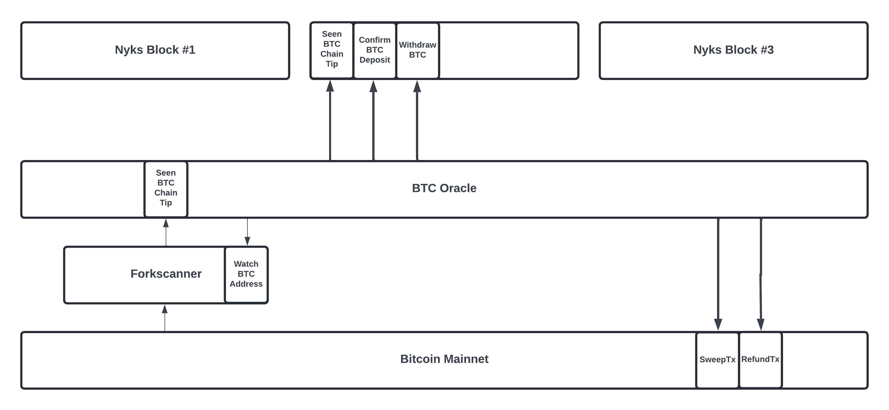

# Twilight Open-Testnet-1 🧪 ⚙️

This repo contains docker files to run the Twilight.

## Architecture



## What's Included?
- Nyks (pseudo name of the chain)
- Forkscanner (monitors Bitcoin Mainnet for forks and update them inside the nyks blockchain)
- BTC Oracle (communicates with Forkscanner and Nyks)

## What's Not Included?
- ZkOS or other VMs

## Docker Features

The Twilight docker repo performs the following tasks:

- **BTC Nodes**: This system will connect with hosted bitcoin nodes. In case switch to switch to your own node, pleasea update the forkscanner/nodes_setup.sql file.

- **Storage (Postgres)**: Creates a container for postgres with respective volume for persistent storage, creates Databases and applies schemas

- **Forkscanner**: Builds and runs forkscanner in a docker container

- **Network**: Create a network to allow inter container communication

- **Nyks**: Builds and runs the Nyks chain

- **BTC Oracle**: Builds and runs the BTC Oracle 

###  How To Run

To run Twilight, follow these steps:

1. Install [Docker](https://www.docker.com/)

2. Clone this repo.

3. Go to the Root Folder. This folder will have the docker-compose.yml file

4. run the command

```bash
docker-compose up
```
This command will create docker containers, clone twilight repos in those containers, build and run the system.

#### Processor Architecture
The name of the nyks release executable file varies depending on the processor's architecture and the operating system. Please ensure that you update line 45 in the `/nyks/Dockerfile` accordingly:
1. For Linux on an Apple chipset, replace with `RUN tar -xf nyks_linux_arm64.tar.gz`.
2. For Linux on an AMD/Intel chipset, replace with `RUN tar -xf nyks_linux_amd64.tar.gz`.
3. For macOS on an Apple chipset, replace with `RUN tar -xf nyks_darwin_arm64.tar.gz`.

#### Key Points to Consider
1. When the docker starts the chain. it will go into initial block download (IBD) phase. This means that your node has joined the chain and is catching up. We cannot run btc-oracle until the chain has caught up.
2. When the chain starts, your twilight address will be displayed. Once the chain is up to date, please get back to us so that we can send nyks tokens to your address. 
3. Once the IBD is done, go to ./scripts/nyks_entrypoint.sh file and uncomment line 10. Then simply rerun the container using the commands 
```bash
docker-compose down
docker-compose up
```

## Configurations

#### Nyks
As of now the docker container builds and joins to an existing chain. If you want to star a standalone node or a new chain, then docker file needs to be changed. This information is mentioned as comments in the ./nyks/dockerfile. 

#### Forkscanner
We have configures Forkscanner to connect to 3 of our btc nodes, if you want to change the connection settings please refer to /forkscanner/nodes_setup.sql file.

#### BTC Oracle
Right now there is a simple built in btc wallet. To init this wallet there are 3 options mentioned below.

1. A new wallet. in which case we will create a new mnemonic and share it with you.
    `/testnet/btc-oracle/forkoracle-go --new_wallet true`
2. Import wallet with mnemonic. in which case you can provide the 12 word mnemonic and we will generate the keypair from it.
    `/testnet/btc-oracle/forkoracle-go --new_wallet true  --mnemonic "<12 word mnemonic>"`
3. Load wallet. in which case we will load a wallet using the encrypted seed file iv.txt.  
    `/testnet/btc-oracle/forkoracle-go`

#### Storage
The Docker compose used the following directories for persistent storage. If you want to remove all the data, delete the following
1. /nyks/data/
2. /psql/data/

#### SSH into the container
After the docker images are built and the container are running. you can ssh into the container using the below command.
```bash
docker ps
```
Above command will the active containers along with their Ids.

```bash
docker exec -it <container id> /bin/bash
```

## Testing
Once the containers are up you can run the following command to check if they are working fine.
1. ```curl --location 'http://<ip address>:<port>' --header 'Content-Type: application/json' --data '{"method": "get_tips", "params": { "active_only": false }, "jsonrpc": "2.0", "id": 1}' ```
 This will give us the current chaitips from forkscanner.It will only work if forkscanner is working properly. Please note that it can take some time (approx. 10 min), since forkscanner need to process 100 historic blocks before becoming active.

 2. ```curl http://localhost:26657/status ```
 This will retrieve the current status for the nyks node. This contains information such as no. of peers and if the node is catching up.

 3. ```docker exec -it <psql container id> psql -U forkscanner -d forkscanner ```
    ```docker exec -it <psql container id> psql -U forkscanner -d judge ```
    These commands will open psql for the database Forkscanner (used by Forkscanner) and Judge(used by Btc-Oracle) respectively. Afterwards you can query the chaintips table. 
    ```select * from chaintips;```

## Join the network
You can use the following create-validator command to become a validator:

```
nyksd tx staking create-validator --amount=100000000nyks --pubkey=[your-pub-key] --moniker="validator-self" --chain-id=nyks --commission-rate="0.10" --commission-max-rate="0.20" --commission-max-change-rate="0.01" --min-self-delegation="1" --gas="auto" --gas-prices="0nyks" --from=validator-self --keyring-backend test
```

## Create a new network
To create a new network please refer to the docekrize/nyks/Dockerfile file. please uncomment the "new network" section and comment out the "join network" section near line 50.

## Grafana Stats
To Enable Grafana stats, please ssh into container using the steps mentioned above. the configurations can be found in the following file

1. /root/.nyks/config/config.toml section "Instrumentation Configuration Options"
2. /root/.nyks/config/app.toml section "Telemetry Configuration"

here are the sample configurations to enable these

[telemetry]
service-name = ""
enabled = true
enable-hostname = true
enable-hostname-label = true
enable-service-label = true
prometheus-retention-time = 5000
global-labels = []

[instrumentation]
prometheus = true
prometheus_listen_addr = ":26660"
max_open_connections = 3
namespace = "tendermint"

Once the stats are enabled, they will be available on port 26660. you can visit this [link](https://medium.com/@ironsf/zetachain-testnet-monitoring-with-grafana-35609cd9308e) for a complete guide on how to deploy a prometheus and grafana server

latest_sweep_tx_hash stat is broadcasted by btc-oracle on port 2555

