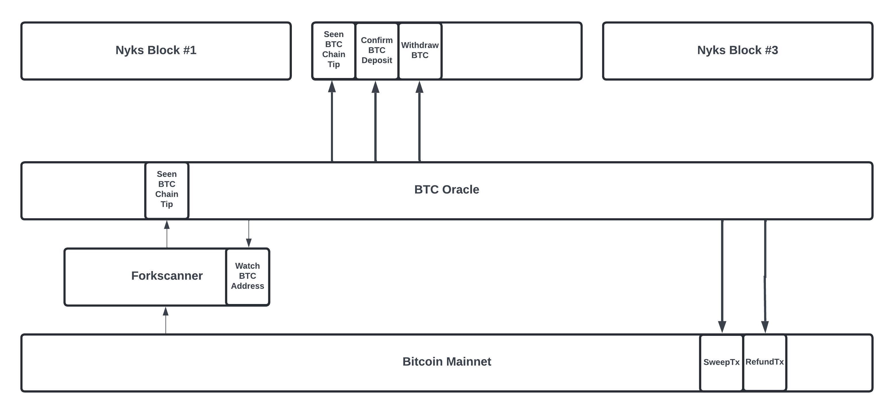

# Twilight Open-Testnet-2  🧪 ⚙️

# Validator Node setup

This repository contains docker files necessary for setting-up and deploying the validator node. It sets up a new testnet which include running NYKS validator node, Running ZKOS and running the faucet.
Please keep in mind that this testnet relies on faucet for both Nyks and Btc (on NYKs chain) tokens. Hence we dont need to run the BTC oracle and BTC forkscanner for this testnet. So please ignore any reference to BTC oracle and forkscanner in this document. 

## Architecture



## What's Included?
- nyks 
- ZKOS
- Faucet


## What's Not Included?
- BTC Oracle
- BTC Forkscanner

## Docker Features

The Twilight docker script performs the following tasks:

- **nyks**: Builds and runs the Cosmos SDK full node.
- **zkos**: Builds and runs ZKOS.
- **Storage (Postgres)**: Creates a PostgreSQL container with a volume for persistent storage, sets up the necessary databases, and applies the required schemas.
- **Faucet**: Deploys a faucet for testnet funds.


##  Run a Validator

To build and run the validator node, follow these steps:

1. Install [Docker](https://docs.docker.com/get-docker/) from the specified link.

2. Make a clone of this [repository](https://github.com/twilight-project/testnets).

3. Go to the [open-testnet-2](/open-testnet-2/validator-docker/) directory. This contains the main docker-compose.yml file.

4. Select the appropriate [Processor Architecture](#processor-architecture) for your node and update the [configuration](#configurations) options. 

5. run the command

   ```bash
   docker compose up
   ```
   This command will create docker containers, clone required repositories, and then build and initialize the chain. 

## Getting Validator address from the container (optional)

1. SSH into the `nyks` [docker](#ssh-connection-to-the-container) container.
   ```bash
   cd /testnet/nyks/release
   ```
2. Show the validator address. 
   ```bash 
   nyksd keys show validator-self --bech val --keyring-backend test
   ```
3. Show the canonical account address of the validator. 
   ```bash 
   nyksd keys show validator-self --keyring-backend test
   ``` 

### Processor Architecture
The name of the `nyks` release executable file varies depending on the processor's architecture and the operating system. Please ensure that you update line 47 in the [nyks/Dockerfile](/open-testnet-2/validator-docker/nyks/Dockerfile) accordingly:
- For Linux on an Apple chipset, replace with `RUN tar -xf nyks_linux_arm64.tar.gz`.
- For Linux on an AMD/Intel chipset, replace with `RUN tar -xf nyks_linux_amd64.tar.gz`.
- For macOS on an Apple chipset, replace with `RUN tar -xf nyks_darwin_arm64.tar.gz`.

### Configurations

#### nyks
Currently, the docker container is configured to build a standalone node and creates a new chain. if you want to make any configuration changes to nyks chain. you will have to open the docker container in interactive mode and make changes the following files accordingly (see the SSH section below).
1. genesis.json
2. config.toml
3. app.toml

## Storage
The Docker container uses the following directories for persistent storage. Delete the following folders to completely remove all chain data, 
1. /nyks/data/
2. /psql/data/

## SSH connection to the container
A user can SSH into the container using the following commands:

1. List the active containers along with their IDs:
```bash
   docker ps
```
2. Access the desired container using its ID:
```bash
   docker exec -it <container_id> /bin/bash
```
## Testing
Run the following commands to validate the system.

1. ```curl --location 'http://<ip address>:<port>' --header 'Content-Type: application/json' --data '{"method": "get_tips", "params": { "active_only": false }, "jsonrpc": "2.0", "id": 1}' ```

This will give us the current BTC chaitips from forkscanner. It will only work if forkscanner is working properly. Please note that it can take some time (approx. 10 min), since forkscanner need to process 100 historic blocks before becoming active.

2. ```curl http://localhost:26657/status ```
This will retrieve the current status for the nyks node. This contains information such as no. of peers and if the node is catching up.


## Join the network
You can use the following create-validator command to become a validator:

```bash
nyksd tx staking create-validator --amount=100000000nyks --pubkey=[your-pub-key] --moniker="validator-self" --chain-id=nyks --commission-rate="0.10" --commission-max-rate="0.20" --commission-max-change-rate="0.01" --min-self-delegation="1" --gas="auto" --gas-prices="0nyks" --from=validator-self --keyring-backend test
```

## Grafana Stats
To enable Grafana stats, please [SSH](#ssh-connection-to-the-container) into the container. The configurations can be found in the following file

1. [Instrumentation configuration](#instrumentation-configuration) section is found in `/root/.nyks/config/config.toml`  
2.  [Telemetry configuration](#telemetry-configuration) section is found in `/root/.nyks/config/app.toml`  

Sample configurations to enable stats
#### Telemetry Configuration
```
[telemetry]
service-name = ""
enabled = true
enable-hostname = true
enable-hostname-label = true
enable-service-label = true
prometheus-retention-time = 5000
global-labels = []
```
#### Instrumentation Configuration
```
[instrumentation]
prometheus = true
prometheus_listen_addr = ":26660"
max_open_connections = 3
namespace = "tendermint"
```
After enabling the statistics, they will be accessible on port 26660. For detailed instructions on deploying a Prometheus and Grafana server, you can refer to this [link](https://medium.com/@ironsf/zetachain-testnet-monitoring-with-grafana-35609cd9308e)

`latest_sweep_tx_hash` stat is broadcasted by `btc-oracle` on port 2555
