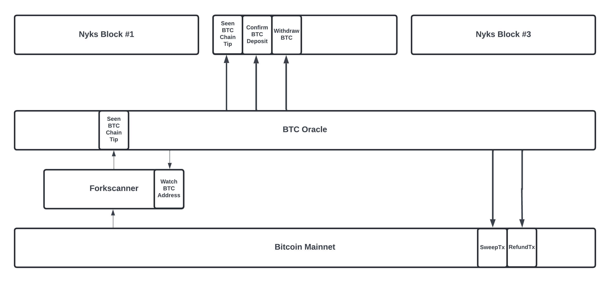

# Twilight Open-Testnet-2  🧪 ⚙️

# Validator Node setup

This repository contains docker files necessary for setting-up and deploying the validator node. It can also be used to creata a new network of validators.  

## Architecture



## What's Included?
- nyks 
- btc-oracle (relayer between Bitcoin Mainnet and Nyks)
- Forkscanner (monitors Bitcoin Mainnet for forks)


## What's Not Included?
- ZkOS or other VMs

## Docker Features

The Twilight docker script performs the following tasks:

- **nyks**: Builds and runs the Cosmos SDK full node and btc-oracle program.
- **forkscanner**: Builds and runs the Forkscanner program. This system connects to 3 Twilight's hosted Bitcoin full nodes. If you prefer to use your own Bitcoin Core nodes, please update the [nodes_setup.sql](/open-tetnet-2/validator-docker/forkscanner/nodes_setup.sql) file with the relevant details.
- **Storage (Postgres)**: Creates a PostgreSQL container with a volume for persistent storage, sets up the necessary databases, and applies the required schemas.


##  Run a Validator

To build and run the validator node, follow these steps:

1. Install [Docker](https://docs.docker.com/get-docker/) from the specified link.

2. Make a clone of this [repository](https://github.com/twilight-project/testnets).

3. Go to the [open-testnet-2](/open-tetnet-2/validator-docker/) directory. This contains the main docker-compose.yml file.

4. Select the appropriate [Processor Architecture](#processor-architecture) for your node and update the [configuration](#configurations) options. 

5. run the command

```bash
   docker-compose up
```
This command will create docker containers, clone required repositories, and then build and initialize the chain. 

6. SSH into the `nyks` [docker](#ssh-connection-to-the-container) container.
```bash
   cd /testnet/nyks/release
```
7. Show the validator address. 
```bash 
nyksd keys show validator-self --bech val --keyring-backend test
```
8. Show the canonical account address of the validator. 
```bash 
nyksd keys show validator-self --keyring-backend test
```
9. Map the newly created validator in the chain to setup their `btcOracleAddress`, `btcPublicKey` and `validatorAddress` 
```bash 
nyksd tx nyks set-delegate-addresses <validator_address> <account_address> <btcPublicKey> --from <validator-self> --chain-id nyks --keyring-backend test
``` 
where: 
   - `validator_address` is the validator address of the new node.
   - `account_address` is the canonical account address of the new node.
   - `btcPublicKey` BTC public key associated with the validator. Forn the purposes of this testnet, any valid btcPublicKey can be used.   

10. Start the `btc-oracle` once the `set-delegate-address` is executed  
```bash
   cd /testnet/btc-oracle
   ./testnet/btc-oracle/btcoracle
```

## Run a Judge
To build and run the validator node as Judge, follow these steps:

1. Perform steps 1 - 9 of [run a Validator](#run-a-validator) to setup and deploy basic validator node.

2. SSH into the nyks [docker](#ssh-connection-to-the-container) container.
goto the following folder
```bash
   cd /testnet/nyks/release/
``` 
3. Register the Judge by initiating the fragment bootstrap process. 
   ```bash
   nyksd tx bridge bootstrap-fragment <judge_address><numOfSigners><threshold><signerApplicationFee><fragmentFeeBips><arbitraryData> --from validator-self --chain-id nyks --keyring-backend test
   ```
   where: 
   - `judgeAddress` = Ordinary twilight account address.
   - `numOfSigners` = A Fragment should have 6 signers.
   - `threshold` = Multisig threshold, minimum 2 signers.
   - `signerApplicationFee` = Fragment specified fee for signers to send applications, this is for spam      protection. If a Fragment owner doesn’t accept an application, that Fee is confiscated by the module.
   - `fragmentFeeBips` = Specify how much fee a Fragment wants to charge out of deposits.
   - `arbitraryData` = Any string Fragment owner want to publish.

   Example command setting up a fragment of 6 signers with a threshold of 4. 
   ```bash
   nyksd tx bridge bootstrap-fragment $(nyksd keys show validator-self -a --keyring-backend test) 6 4 1 1 test --from validator-self --chain-id nyks --keyring-backend test
   ```
4. Query the fragment information by using: 
   ```bash
   nyksd q volt get_all_fragments
   ```
   Communicate your fragment ID to signers and ask them to send signer applications.

5. Accept signer applications using:
   ```bash
   nyksd tx volt accept-signers <fragmentID> <signerApplicationIds> --from validator-self --chain-id nyks --keyring-backend test
   ```
   where: 
   - `fragmentId` = The ID of the fragment signer wants to join.
   - `signerApplicationIds` = Comma-separated list of signer application IDs.

   example command accepting a signer for fragment ID = 1
   ```bash
   nyksd tx volt accept-signers 1 1 --from validator-self --chain-id nyks --keyring-backend test
   ```    
6. Once, a fragment has all of the signers, register a reserve for a fragment ID using:
   ```bash
   nyksd tx bridge register-reserve-address <fragmentId> <reserveScript> <reserveAddress> --from validator-self --chain-id nyks --keyring-backend test
   ```
   - `fragmentId` = The ID of the fragment signer wants to join.
   - `reserveScript` = BTC reserve script.
   - `reserveAddress` = BTC reserve address.
7. Start the `btc-oracle` once the `register-reserve-address` is executed  
   ```bash
      cd /testnet/btc-oracle
      ./testnet/btc-oracle/btcoracle
   ```

#### Processor Architecture
The name of the `nyks` release executable file varies depending on the processor's architecture and the operating system. Please ensure that you update line 47 in the [nyks/Dockerfile](/open-tetnet-2/validator-docker/nyks/Dockerfile) accordingly:
1. For Linux on an Apple chipset, replace with `RUN tar -xf nyks_linux_arm64.tar.gz`.
2. For Linux on an AMD/Intel chipset, replace with `RUN tar -xf nyks_linux_amd64.tar.gz`.
3. For macOS on an Apple chipset, replace with `RUN tar -xf nyks_darwin_arm64.tar.gz`.

## Configurations

### nyks
Currently, the docker container is configured to build a standalone node and creates a new chain. If you wish to join an existing chain, modifications to the [Dockerfile](/open-tetnet-2/validator-docker/nyks/Dockerfile) will be necessary. 
#### Instructions for joining existing network
Make the following changes in the docker script to join an existing network. 
1. Comment out the section for `single node setup`
2. Uncomment the section for `joining existing chain`
3. Provide the `genesis.json` and `persistent_peers.txt` for the existing chain [here](/open-tetnet-2/required-files/).

4. Upon initialization, the node will enter the Initial Block Download (IBD) phase. This indicates that your node has joined the chain and is currently synchronizing. During this period, `btc-oracle` program cannot be run until the chain has synchronized completely. 

### btc-oracle
The `btc-oracle` program can be configured to work in `Validator` and or `Judge` mode.
The validator mode is enabled by default in this deployment. 
Uncomment the following line in the [dockerfile](/open-tetnet-2/validator-docker/nyks/Dockerfile) to enable the validator to act as a `Judge` as well. 
```
#RUN sed -i '14s|.*| "running_mode": judge,|' config.json
```
## Storage
The Docker container uses the following directories for persistent storage. Delete the following folders to completely remove all chain data, 
1. /nyks/data/
2. /psql/data/

## SSH connection to the container
A user can SSH into the container using the following commands:

1. List the active containers along with their IDs:
```bash
   docker ps
```
2. Access the desired container using its ID:
```bash
   docker exec -it <container_id> /bin/bash
```
## Testing
Run the following commands to validate the system.

1. ```curl --location 'http://<ip address>:<port>' --header 'Content-Type: application/json' --data '{"method": "get_tips", "params": { "active_only": false }, "jsonrpc": "2.0", "id": 1}' ```

This will give us the current BTC chaitips from forkscanner. It will only work if forkscanner is working properly. Please note that it can take some time (approx. 10 min), since forkscanner need to process 100 historic blocks before becoming active.

2. ```curl http://localhost:26657/status ```
This will retrieve the current status for the nyks node. This contains information such as no. of peers and if the node is catching up.

3. ```docker exec -it <psql container id> psql -U forkscanner -d forkscanner ```
    ```docker exec -it <psql container id> psql -U forkscanner -d judge ```

These commands will open psql for the database Forkscanner (used by Forkscanner) and Judge (used by Btc-Oracle) respectively. Afterwards you can query the chaintips table. 
    ```select * from chaintips;```

## Join the network
You can use the following create-validator command to become a validator:

```bash
nyksd tx staking create-validator --amount=100000000nyks --pubkey=[your-pub-key] --moniker="validator-self" --chain-id=nyks --commission-rate="0.10" --commission-max-rate="0.20" --commission-max-change-rate="0.01" --min-self-delegation="1" --gas="auto" --gas-prices="0nyks" --from=validator-self --keyring-backend test
```

## Create a new network
To create a new network please refer to the [nyks/Dockerfile](/open-tetnet-2/validator-docker/nyks/Dockerfile). Please uncomment the `new network` section and comment out the `join network` section.

## Grafana Stats
To enable Grafana stats, please [SSH](#ssh-connection-to-the-container) into the container. The configurations can be found in the following file

1. [Instrumentation configuration](#instrumentation-configuration) section is found in `/root/.nyks/config/config.toml`  
2.  [Telemetry configuration](#telemetry-configuration) section is found in `/root/.nyks/config/app.toml`  

Sample configurations to enable stats
#### Telemetry Configuration
```
[telemetry]
service-name = ""
enabled = true
enable-hostname = true
enable-hostname-label = true
enable-service-label = true
prometheus-retention-time = 5000
global-labels = []
```
#### Instrumentation Configuration
```
[instrumentation]
prometheus = true
prometheus_listen_addr = ":26660"
max_open_connections = 3
namespace = "tendermint"
```
After enabling the statistics, they will be accessible on port 26660. For detailed instructions on deploying a Prometheus and Grafana server, you can refer to this [link](https://medium.com/@ironsf/zetachain-testnet-monitoring-with-grafana-35609cd9308e)

`latest_sweep_tx_hash` stat is broadcasted by `btc-oracle` on port 2555
